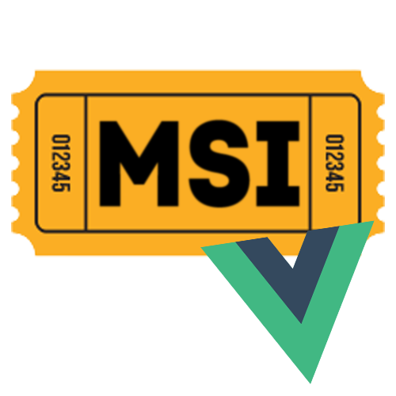
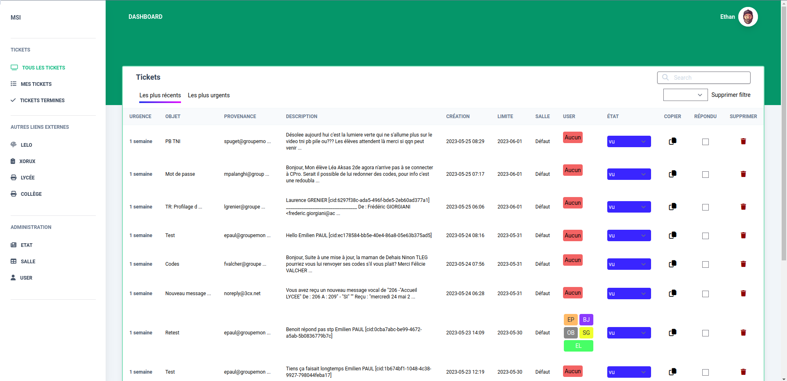

<div id="top"></div>

<!-- PROJECT LOGO -->
<br />
<div align="center">



<h3 align="center">MSI - FrontEnd</h3>

   <p align="center">
      Logiciel de gestion de tickets en interne !  
   </p>
</div>



### Back-End
<p>
   L'API faite en Symfony est disponible ici : <a href="http://gitea.groupemontroland.fr/epaul/msi_back">clique ici !</a>
</p>

### Développer Avec

* [TypeScript 4](https://www.typescriptlang.org/)
* [Vue 3](https://vuejs.org/)
* [Pinia 2](https://pinia.vuejs.org/)
* [Vitest](https://vitest.dev/)

<!-- GETTING STARTED -->

## Mise en Place

Voici la démarche à faire pour installer le repo et mettre en place le site web.

### Prerequisites

1. Installer nodejs
2. Installer npm

### Configuration

1. Configurer les variables d'environnement (.env)
   ```dotenv
   VITE_API_URL=http://localhost:8000/api/
   ```
   Vous devez modifier la variable **VITE_API_URL** qui contient l'url de l'api symfony.

### Installation

1. Cloner le Repo
   ```dotenv
   git clone http://gitea.groupemontroland.fr/sguillot/msi-front.git
   ```
2. Aller dans le dossier
   ```dotenv
   cd msi-front/ 
   ```
3. Installer les dépendances JavaScript
   ```dotenv
   npm install
   ```
4. Démarrer le serveur local
   ```dotenv
   npm run dev
   ```
5. Ouvrez votre navigateur et aller à l'adresse suivante :
   ```dotenv
   localhost:5173
   ```

### Déployer

1. Déployer avec Ansible
   ```dotenv
   ansible-playbook ansible/playbook.yml
